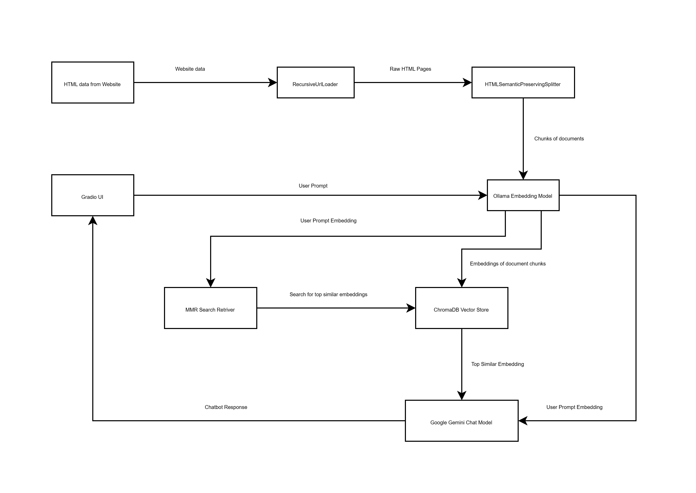

# Chatbot

The chatbot has been developed using a RAG based model. The RAG based model is a technique where context data is first fetched from its source. Then it is divided into chunks. Next the chunks are converted into embeddings. The embeddings are then stored in vector db. When the bot gets a prompt it is first converted into an embedding as well and the app tries to find a specific number of similar kinds of embeddings from the vector db. This type of search is also known as “Semantic Search”. These steps are necessary as the amount of data in the context is usually too much for any LLM. Even if the model is able to work with that amount of data it will still cost a lot of time and money. Once, we got the embeddings of the similar context and user prompt. We can feed these to the LLM Model. We also need to implement memory of the app as well. Otherwise, each time we get a new prompt from the user, the LLM will have no idea of the previous prompts and responses.


## Tools, Libraries, Classes used:
- Main Framework used : Langchain
- HTMLLoader : RecursiveUrlLoader
- TextSplitter: HTMLSemanticPreservingSplitter
- Embedding Tool : OllamaEmbeddings
- Embedding Model : mxbai-embed-large:335m
- Vector Store : ChromaDB
- Retriever Search Type : MMR
- ChatModel : Google Gemini
- UI : Gradio


## Flow Diagram


## Steps to Run the App

### Set PYTHONPATH
- Set the PYTHONPATH Environment Variable. For eg.:
```sh
set PYTHONPATH=.
```

### Install dependencies
- You need to install them one by one as there are lot of conflicts
```sh
pip install -qU langchain-chroma
pip install -qU langchain-ollama
pip install -qU langchain-google-genai
pip install -qU gradio
pip install -q protobuf==5.29.4
pip install -qU langchain-community
pip install -qU langchain-text-splitters
pip install -qU beautifulsoup4 lxml
```

### Add your Google API Key
Add you Google API Key in the file 
```sh
./chatbot/driver/.env
```

### Run the App
First prepare the embeddings with this command:
```sh
python3 ./prepareembeddings/EmbeddingPrepare.py
```
Run the python app with this command
```sh
python3 ./chatbot/driver/DriverClass.py
```